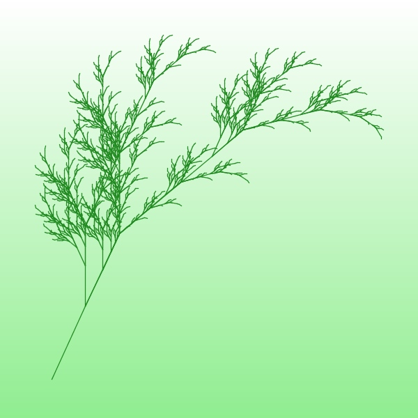
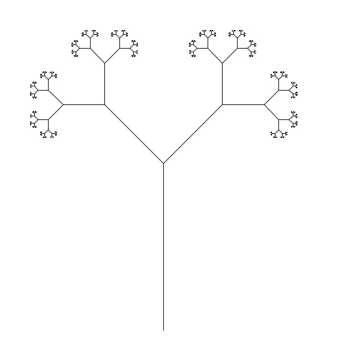

# lsystems

### [API docs](https://joebentley.github.io/lsystems/)

[](https://clojars.org/lsystems)

Simple and easy to use implementation of L-systems in Clojure.

L-systems were invented by Aristid Lindenmayer as a way to model bacteria growth,
and are described as a recursive transformation of a sequence of symbols called a "string".
By taking an initial string and repeatedly applying the transformation rules, called
"productions", complicated evolving strings can be created.

By using [turtle graphics](https://en.wikipedia.org/wiki/Turtle_graphics)–where a pen
is controlled by movement commands and lines are drawn out along its movement path–we
can assign different commands to different symbols, for example:

* `F` could mean "move the pen forward by 10 pixels along its current direction"
* `+` could mean "rotate the pen's direction clockwise 25 degrees"

The symbols will often have a different meaning depending on the specific system. Two
symbols that are usually the same among L-systems are:

* `[` meaning "push the pen's position and direction to the stack"
* `]` meaning "pop the position and direction from the stack
and set the pen's position and direction to that value"

These commands are used to make branching and repeating tree-like structures.

Uses the excellent [Clojure2D](https://github.com/Clojure2D/clojure2d) for rendering.

## Examples

To list possible examples:

```
> lein run -m lsystems.examples --list
examples:
fractal-binary-tree
fractal-plant
```

Then to run an example:

```
> lein run -m lsystems.examples fractal-binary-tree
running example fractal-binary-tree...
(window will display)
```

To run all examples pass `--all`.

See [the examples](./src/lsystems/examples.clj) file. I'll explain one here:

```clojure
(require
  [lsystems.core :refer [nth-step]]
  [lsystems.turtle :refer :all]
  [clojure2d.core :as c])

(defn fractal-plant []
  (let [width 600 height 600]
;; 1.
    (render-to-canvas-by-executing-state-with-rules
;; 2.
      (nth-step {\X (seq "F+[[X]-X]-F[-FX]+X") \F '(\F \F)}
                \X
                6)
;; 3.
      {\F (fn [s] (forward s 10))
       \- (fn [s] (rotate s (- 25)))
       \+ (fn [s] (rotate s (+ 25)))
       \[ (fn [s] (push-pos-and-angle s))
       \] (fn [s] (pop-pos-and-angle s))}
;; 4.
      (fn [canvas]
        (show-window canvas "Fractal plant")
        (save-canvas-to-file canvas "example-renders/fractal-plant.jpg"))
;; 5.
      :facing -25 :width width :height height :auto-resize-padding 50
;; 6.
      :canvas-function (fn [canvas]
                         (c/gradient-mode canvas 0 0 :white 0 height :light-green)
                         (c/rect canvas 0 0 width height)
                         (c/set-color canvas :forest-green)
                         (c/set-stroke canvas 1.3)))))

(fractal-plant)
```

1. The call `(render-to-canvas-by-executing-state-with-rules ...)` takes three mandatory arguments,
 a produced L-system state, a series of rules for symbols in the state that take
 the pen state (see [turtle.clj](./src/lsystems/turtle.clj))
 and performs a pen movement action using it (e.g. [(forward ...)](https://joebentley.github.io/lsystems/lsystems.turtle.html#var-forward))
 and finally a function that takes the resulting canvas and uses it, e.g. to save it to an image file,
 and optionally many keyword options that can alter the appearance of the produced image. 

2. The function `(nth-step [productions state n])` from [core.clj](./src/lsystems/core.clj)
 takes a set of production rules, in this case `{\X (seq "F+[[X]-X]-F[-FX]+X") \F '(\F \F)}`.
 Here we have a map that replaces the character `\X` with the list of characters
 `(seq "F+[[X]-X]-F[-FX]+X")` (**note** you must turn it into a sequence of characters,
 rather than just using a string), while `\F` is replaced by the list `'(\F \F)` (which is the
 same as `(seq "FF")`. `state` is the initial state of the L-system, and `n` is the number
 of iterations to calculate, in this case 6 iterations.
 
3. This is a map from characters in the string to functions that take the current pen state
 and return an updated pen state. For example `\F` moves the pen forward by 10 pixels,
 and `\[` pushes the current pen position and direction to `(pen-state :stack)`.

4. This function uses the resulting canvas created by executing the L-system with the given rules. Here
 we show the canvas in a window with title "Fractal plant" and also save it as a jpeg.

5. Some examples of the possible keyword arguments. `:facing` is the initial pen direction,
`:width` and `:height` are the image dimensions,
 auto resizing of the generated line segments to fit the image is performed by default, and
 `:auto-resize-padding` is used to set the padding around the image.
 
6. A function `:canvas-function` can be passed that takes a
 [Clojure2D Canvas object](https://clojure2d.github.io/clojure2d/docs/codox/clojure2d.core.html)
 which can be used to do some set up _before_ the lines are drawn. For example here we set a gradient
 from white to light green and draw a rect for the background, then we set the stroke
 colour and width for the lines. 

`render-to-canvas-by-executing-state-with-rules` uses `(execute-state-with-rules [state rules pen-state])`
to execute the rules. The pen-state stores the beginning and end of the line segments
internally when `(forward [pen-state by-pixels])` is called, then `(draw-lines [canvas lines])`
is used to draw all the line segments.

The `(forward [pen-state by-pixels])` function actually checks whether the
pen is in the same direction as the previously call by using a cached value stored on `pen-state`, if it does then the
previous line segment is extended rather than a new line being drawn. This helps with performance (less lines to draw)
and also helps with the smoothness of the resulting lines.

Produced image:



## TODO

* Draw multiple L-systems on one canvas
* ~~Distribution/clojars~~
* Stochastic/context-sensitive L-systems
* ~~Lines could do with smoothing. They look weird right now, probably because of being drawn as loads of individual lines~~
* Write tests for `lsystems.turtle`
* ~~Easy way to run examples~~
* Performance profiling
* Fix centering of images when using `(fit-line-segments-to-screen ...)`, currently they are off centre sometimes
* Program takes a long time to close, maybe unavoidable and it's just the JVM

## Directory structure

* `/src` source files
* `/test` tests
* `/doc` markdown files for building docs (build docs with `lein codox`)
* `/docs` codox HTML output directory

## References

* https://jsantell.com/l-systems

* https://en.wikipedia.org/wiki/L-system

* [The Algorithmic Beauty of Plants](http://algorithmicbotany.org/papers/#abop)

## Other examples

### Dragon curve


### Fractal Binary Tree



## License

Copyright © 2019 Joe Bentley joebentley10@gmail.com

This program and the accompanying materials are made available under the
terms of the Eclipse Public License 2.0 which is available at
http://www.eclipse.org/legal/epl-2.0.

This Source Code may also be made available under the following Secondary
Licenses when the conditions for such availability set forth in the Eclipse
Public License, v. 2.0 are satisfied: GNU General Public License as published by
the Free Software Foundation, either version 2 of the License, or (at your
option) any later version, with the GNU Classpath Exception which is available
at https://www.gnu.org/software/classpath/license.html.
